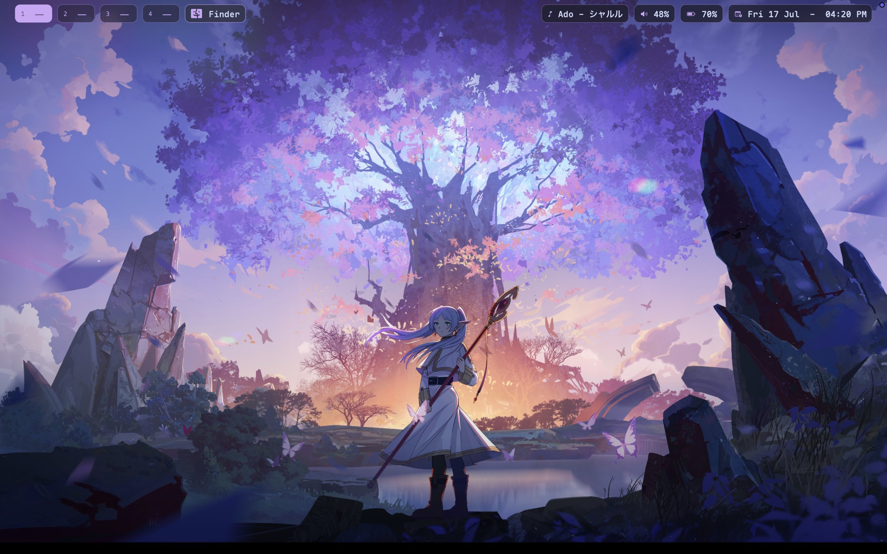
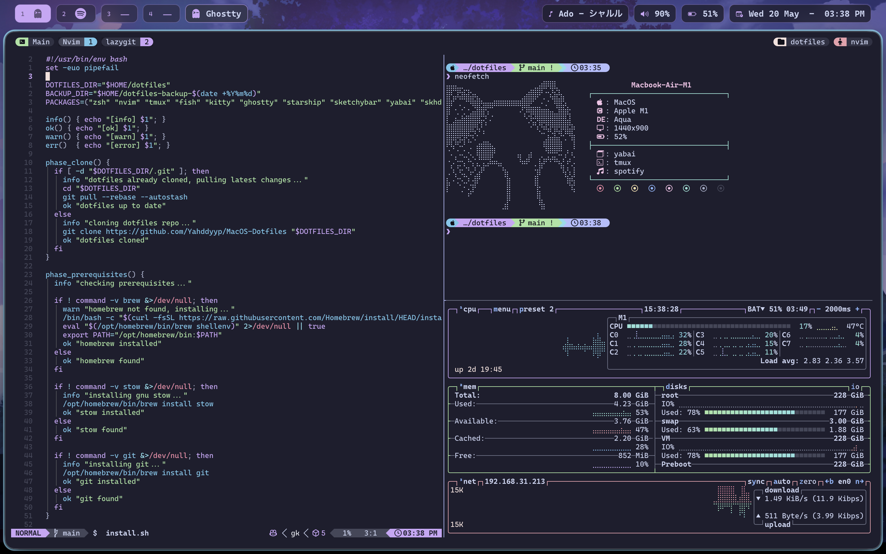

# MacOS Dotfiles



## Tools and apps I use:

### Window Management
- **[yabai](https://github.com/koekeishiya/yabai)** — Tiling window manager
- **[skhd](https://github.com/koekeishiya/skhd)** — Hotkey daemon
- **[JankyBorders](https://github.com/FelixKratz/JankyBorders)** — Window border highlighting

### Status Bar
- **[sketchybar](https://github.com/FelixKratz/sketchybar)** — Highly customizable macOS status bar replacement

### Terminal
- **[zsh](https://zsh.org/)** + **[oh-my-zsh](https://ohmyz.sh/)** + **[Powerlevel10k](https://github.com/romkatv/powerlevel10k)** — Shell framework & prompt theme
- **[fish](https://fishshell.com/)** — Alternative user-friendly shell
- **[starship](https://starship.rs/)** — Cross-shell prompt
- **[kitty](https://sw.kovidgoyal.net/kitty/)** / **[ghostty](https://ghostty.org/)** — GPU-accelerated terminals
- **[tmux](https://github.com/tmux/tmux)** — Terminal multiplexer

### CLI Tools
| Tool | Purpose |
|------|---------|
| [neovim](https://neovim.io/) | TUI-based Text editor |
| [yazi](https://yazi-rs.github.io/) | Terminal file manager |
| [btop](https://github.com/aristocratos/btop) | System monitor |
| [atuin](https://atuin.sh/) | Shell history replacement |
| [zoxide](https://github.com/ajeetdsouza/zoxide) | Smarter `cd` |
| [fzf](https://github.com/junegunn/fzf) | Fuzzy finder |
| [bat](https://github.com/sharkdp/bat) | `cat` with syntax highlighting |
| [ripgrep](https://github.com/BurntSushi/ripgrep) | Fast `grep` alternative |
| [fd](https://github.com/sharkdp/fd) | Fast `find` alternative |
| [lazygit](https://github.com/jesseduffield/lazygit) | Terminal UI for git |
| [gh](https://cli.github.com/) | GitHub CLI |
| [fastfetch](https://github.com/fastfetch-cli/fastfetch) | Modern `neofetch` alternative |
| [bun](https://bun.sh/) | Fast JavaScript runtime |

### Apps
- **[zed](https://zed.dev/)** / **[vscodium](https://vscodium.com/)** - Pretty good editors
- **[raycast](https://raycast.com/)** — Spotlight replacement
- **[shottr](https://shottr.cc/)** — Screenshot tool
- **[alt-tab](https://alt-tab-macos.netlify.app/)** — Windows-style alt-tab
- **[spotify](https://www.spotify.com/)** + **[spicetify](https://spicetify.app/)** — Themed Spotify
- **[zen](https://zen-browser.app/)** — An arc-like browser
- **[obsidian](https://obsidian.md/)** — Note-taking app
- **[appcleaner](https://freemacsoft.net/appcleaner/)** — App uninstaller

### Fonts
These are required for the icons and styling to appear correctly:
- **[Cascadia Code Nerd Font](https://github.com/ryanoasis/nerd-fonts)** — Main terminal/coding font
- **[Sketchybar App Font](https://github.com/kvndrsslr/sketchybar-app-font)** — Required for Sketchybar icons




## Repository Structure
This repo uses [GNU Stow](https://www.gnu.org/software/stow/) to manage symlinks. Each directory represents a "package":

| Package | Purpose | Target Path |
|---------|---------|-------------|
| `zsh` | Zsh & Theme config | `~/.zshrc`, `~/.config/zsh` |
| `nvim` | Neovim config | `~/.config/nvim` |
| `tmux` | Tmux config | `~/.tmux.conf` |
| `atuin` | History config | `~/.config/atuin` |
| `skhd` | Keybindings | `~/.config/skhd` |
| `yabai` | Window manager | `~/.config/yabai` |
| `home` | Misc home files | `~/.hushlogin` |

## Keybindings (Quick Start)
The full config is in `skhdrc` and `tmux.conf`, but here are the essentials:

### System & Windows (skhd)
- `cmd + return` — Open Terminal (Ghostty)
- `cmd + shift + return` — Open Browser (Zen)
- `alt + h/j/k/l` — Change window focus
- `ctrl + alt + h/j/k/l` — Swap window position
- `ctrl + alt + return` — Toggle fullscreen (Zoom)
- `alt + f / g` — Switch between Float and Tiling (BSP) layout

### Terminal Multiplexer (tmux)
- `ctrl + a` — Prefix
- `prefix + m` — Split vertical
- `prefix + u` — Split horizontal
- `ctrl + h/j/k/l` — Smart pane switching (works with Vim/Atuin)
- `prefix + I` — Install plugins

## Installation
### Without using install.sh (Recommended)
#### Prerequisites:
* git
* The tools in the Dotfiles (Duh)

Clone the repo wherever you like.

```bash
git clone https://github.com/Yahddyyp/MacOS-Dotfiles.git && cd MacOS-Dotfiles
```

Now move them into their respective folders.

But you can move them in using stow as well:

**Install Stow** (With Homebrew)
```bash 
brew install stow 
```

And let stow create symlinks.
```bash 
# Ensure the target config directory exists
mkdir -p ~/.config

# Symlink all packages (using --restow to update and --no-folding to prevent directory issues)
stow --verbose --restow --no-folding */
```

### Using install.sh
**Warning:** This installs more than what is in the Dotfiles and mostly serves as a mean to install my setup on a different machine.

**What it does (in order)**
1. Prerequisites – Installs Homebrew (if missing), stow, and git
2. Backup – Moves any existing dotfiles (.zshrc, .tmux.conf, .config/nvim, etc.) to ~/dotfiles-backup-<date>
3. Oh-My-Zsh – Installs oh-my-zsh (if missing)
4. Clone – Clones the repo to ~/dotfiles (or pulls latest changes if already cloned)
5. Brew Bundle – Installs all tools/apps from the Brewfile (zsh, nvim, tmux, kitty, starship, sketchybar, yabai, skhd, etc.)
6. Stow – Symlinks each package directory (zsh, tmux, nvim, etc.) into your $HOME
7. Post-install – Installs tmux plugins, Spicetify marketplace, removes Dock autohide delay, disables VSCodium press-and-hold

Using the install.sh:

```bash 
curl -fsSL https://raw.githubusercontent.com/Yahddyyp/MacOS-Dotfiles/main/install.sh | bash
```

## Post-Install 
After installation, run these:
1. tmux plugins — Open tmux and press <prefix> + I (Ctrl+A, then I)
2. Spicetify — Open Spotify once, then run `spicetify apply`
3. Start services:

   ```bash
   brew services start sketchybar
   yabai --start-service
   skhd --start-service
   ```

## Inspirations
* https://github.com/gloceansh/dotfiles
* https://github.com/typecraft-dev/dotfiles
* https://github.com/catppuccin

<p align="center"></p>

<p align="center">Made with 💜 by Yahddyyp</p>

