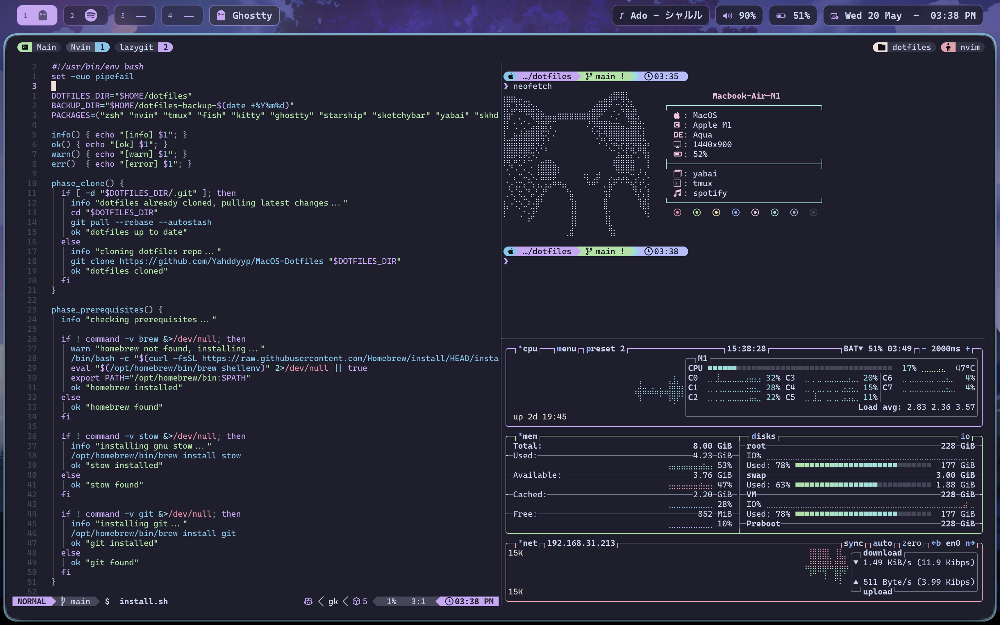

# MacOS Dotfiles




## Installation (Using nix)
### Prerequisites:
* Nix
 ``` bash 
curl --proto '=https' --tlsv1.2 -sSfL https://nixos.org/nix/install | sh -s -- --daemon
```

Clone the repo into a dir called dotfiles:
```bash 
git clone https://github.com/Yahddyyp/MacOS-Dotfiles.git ~/dotfiles
```

>[!Note] 
> git username/email are hardcoded in `nix/modules/git.nix` (edit them there).

Set up `/etc/nix-darwin`:
Symlink the config into place (live link to the repo — edit dotfiles and they're instantly the current source):
```bash
sudo ln -s "$HOME/dotfiles/nix" /etc/nix-darwin
```

Apply the configuration
The symlink above makes `/etc/nix-darwin` available immediately, so every build is the same:

```bash
sudo darwin-rebuild switch --flake /etc/nix-darwin#$(whoami) --impure
```

## Post-Install 
After installation, run these:
1. Tmux plugins — Open tmux and press prefix + I (Ctrl+A, then I)
2. Spicetify — Open Spotify once, then run `spicetify apply`
3. Disable SIP for yabai (Apple Silicon only):
   1. Reboot into recovery mode (hold power button while restarting)
   2. Open terminal and run:

      ```bash
      csrutil enable --without fs --without debug --without nvram
      ```
   3. Enable non-Apple-signed arm64e binaries, then reboot:

      ```bash
      sudo nvram boot-args=-arm64e_preview_abi
      ```

4. Load the scripting addon:

   ```bash 
   sudo yabai --load-sa
   ```

5. Start services:

   ```bash
   source ~/.zshrc
   start-yabai
   ```

## Inspirations
* https://github.com/gloceansh/dotfiles
* https://github.com/typecraft-dev/dotfiles
* https://github.com/catppuccin
* https://github.com/omerxx/dotfiles

<p align="center"></p>

<p align="center">Made with 💜 by Yahddyyp</p>

